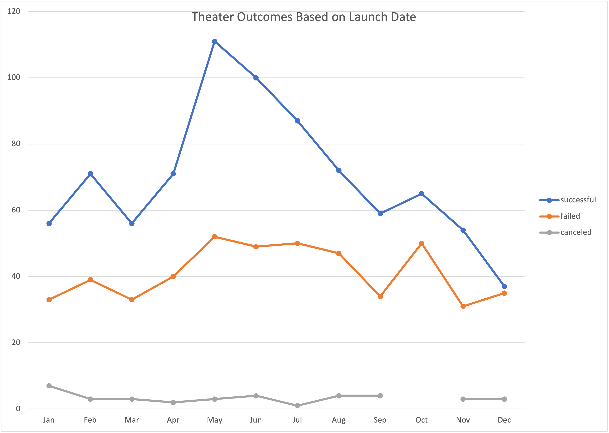
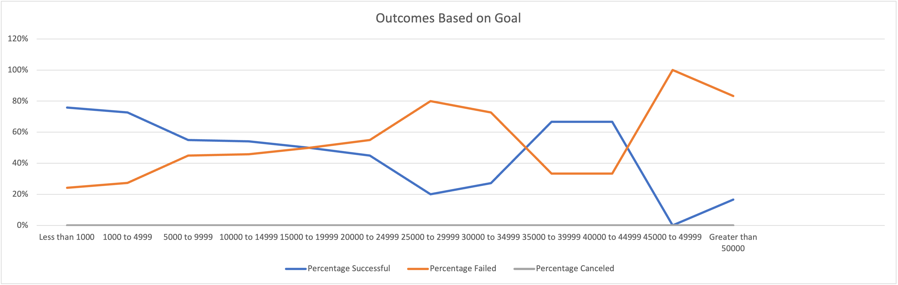

# Kickstarting with Excel

## Overview of Project
  In this project, I examined how different theatrical campaigns fared in relation to their launch dates and fundraising goals.  I measured the outcomes of fundraisers for plays, in terms of their success, fail, or cancel rates and if they met their goal by their launch date.  I will visualize these results using graphs and tables on Excel.  

### Purpose
  I did this analysis to give Louise, my client, a better understanding of how different campaigns, in our case theatrical plays, fared in relation to their funding goals.  And to give her a better sense of when to launch these fundraising campaigns.  

## Analysis and Challenges 
  In the following sections, I will describe how I created the analysis and the challenges that I encountered.
  
### Analysis of Outcomes Based on Launch Date
  In this section, I created a pivot table and line graph.  Using the pivot table, I created a line graph with three lines representing fundraising campaigns that were successful, failed, and canceled over months.  I had to remember to delete the auto-generated data when I populated the rows section with the "Date Created Conversion" field in the pivot table. I did this to accurately reflect the aggregated number of years and display it in months format.  

  After analyzing the data, I realized that early spring, May and June, had the highest rates for success.  Conversely, the highest rates of failure occurred when fundraising campaigns began in October.   

 

### Analysis of Outcomes Based on Goals
  For this section of the analysis, I created a chart that contained a breakdown of the fundraising goal in $5000 increments.  I struggled with formatting the "CountIfs" function because I filtered for different 3 criteria.  This made the formula long and cumbersome.  Fortunately, my thoroughness, diligence, and my over-all detail-oriented nature ensured an accurate reading. 

  This section revealed that plays that had fundraising goals less than $15,000 had a higher success rate.  Conversely, plays that had fundraising goals above $25,000 had a higher failure rate.  

### Challenges and Difficulties Encountered
  Throughout the analysis, I found that the data set was small and did not reflect the entire picture.  For example, it neither answer how many people donated to a particular play nor how the money was distributed within each play.  Did a play have one particular investor that funded the entire play or was it advertised more?  What was the distribution of the funds? Was the money used for more fundraising opportunities or solely to pay for the actors?  
  These are a few of the questions that would give a deeper understanding of what was going on to make the fundraising campaigns a success or failure.  

## Results

1.	I can confidently conclude that fundraising campaigns that began in May have a higher chance of meeting their goal.  Therefore, Louise should start her fundraising campaign in May.  Secondly, fundraising campaigns that began in October have a higher chance of not meeting their goal.  Thus, Louise should wait till the next season if she hasn't started her fundraising campaign by October.  

2. 	I can conclude that a modest budget of less than $15,000 will assist in the fundraising goals being met.  Therefore, I would recommend to Louise to keep the budget small and not over $15,000.  

3. 	Some limitations of this dataset are that it neither includes a budget nor a fundraising plan.  This could play a key role in the success of meeting your goal in knowing where the successful plays distributed their money and who they were soliciting for it.   

4. 	Other possible tables that would help in our analysis would be to create a table based on number of backer and the average donation per play.  This could be charted against fundraising success or failure rates in a line graph and placed in combination with "Outcomes based on Goals" chart.  Likewise, filtering this data in our analysis could help paint a clearer picture in preparing a plan for when, where, and to whom to fundraise.  

	Additionally, adding statistics would give a deeper meaning to our finding.  Adding box plots will help us see campaign goal distribution, outliers, measures of spread, and central tendencies of our data.   
